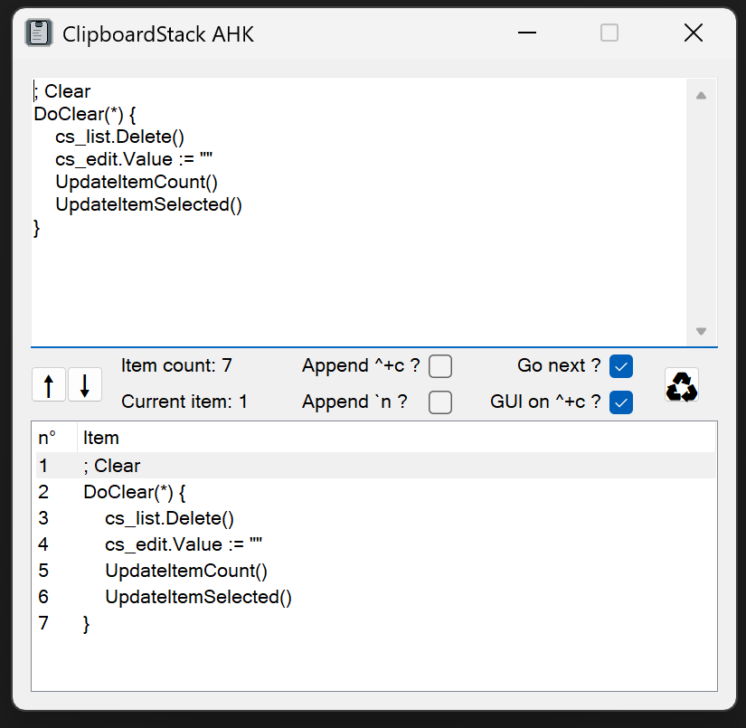

# ClipboardStack

A script allowing copying and pasting multiple items from the clipboard.

## Requirements

All scripts were made for [AutoHotKey v2](https://www.autohotkey.com/).

## Usage

ClipboardStack allow copying multiple text items in a FIFO stack, and allow pasting them one by one automatically. An example use case is copying multiple code lines, and pasting them one by one in a chat.

### Open GUI
To open the gui, one may use the "Show GUI" tray menu entry of the script.

Copying will also open the gui.

### Settings and GUI
The user may change settings on the GUI.

Button descriptions:
- Arrow buttons: convert the list of items to raw text / the raw text to a list of items
- Clear button: clear the stack and raw text
- Append ^+c : New copied text will be appended to the stack, instead of replacing
- Append `n : If enabled, each paste will be automatically followed by a newline sent
- Go next : When pasting, the next item in the stack will be selected automatically
- GUI on ^+c : Show the GUI when copying text 

### Copying
To copy text, use the `Ctrl + Shift + C` hotkey. If multiple lines are selected, each line will be copied as a separate item in the stack.

This will show the gui.

### Pasting
To paste text, use the `Ctrl + Shift + V` hotkey. A sound will be played to indicate that the text was pasted. A different sound will be played when the last item in the stack is pasted.

## License

[MIT](https://choosealicense.com/licenses/mit/)