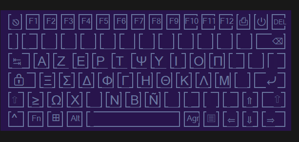

# UnicodeGUI

A collection of scripts for AutoHotKey.

## Requirements

All scripts were made for [AutoHotKey v2](https://www.autohotkey.com/).

## Usage

### UnicodeKeys.ahk
This script implements the character hotkeys.

### UnicodeGUI
This script implements the GUI cheat sheet. Press `LCTRL` (To use `AppsKey`, needs to be changed manually) twice quickly to open the cheat sheet. It can be closed the same way.

### Configure

To add an hotkey:
- Define the ahk Send command in `UnicodeKeys.ahk` with the desired hotkey.
- Add the hotkey to the GUI in `key_definitions.ini`. The columns are defined as such

| row in keyboard | text | (offset x) | (offset y) | (font size) | (override width) | (; comments) |
| --- | --- | --- | --- | --- | --- | --- |

## License

[MIT](https://choosealicense.com/licenses/mit/)